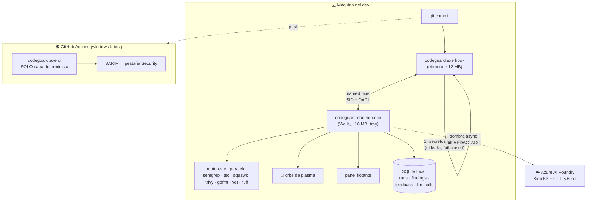

# Arquitectura

Dos procesos + el CI corriendo el mismo binario ([[00 - CodeGuard|principio P3]]).

## Decisiones clave (ADRs)

| | Decisión | Por qué |
|---|---|---|
| ADR-02 | Solo lo determinista bloquea | FP >20-30% = abandono de la herramienta |
| ADR-03 | Mismo binario local y CI | La paridad por construcción, no por promesa |
| ADR-04 | Wails v3, no Electron | 27 MB de binarios vs 120-150 MB |
| ADR-05 | Modelo vía Foundry (nube) | Sin techo de precisión de modelos locales |
| ADR-09 | Windows único target | 99.99% de los devs |
| ADR-12 | Aislamiento por privilegios del SO, no VM | Una sandbox no cabe en 5 s de presupuesto |

Relacionado: [[Flujo del commit]] · [[Hardening]]
