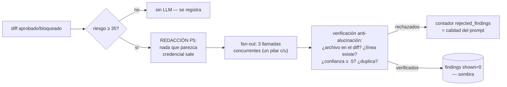

# Capa LLM

**Dos modelos, cada uno en lo suyo** (vía Azure AI Foundry, endpoint compatible OpenAI):

| Modelo | Rol | Por qué |
|---|---|---|
| **FW-Kimi-K3** (razonador) | Análisis profundo de los 3 pilares, en sombra | El razonamiento mejora el hallazgo sutil |
| **gpt-5.6-sol** (rápido) | Tareas mecánicas: "en palabras simples", `rules suggest` | El razonamiento ahí es peso muerto (latencia + truncados) |

El default lo fija el equipo en `config.yaml` **versionado** — cambiar de modelo es un commit; el dev no configura nada. Overrides por pilar disponibles (A/B con DeepSeek V4 Pro pendiente).

## Reglas de la capa

- **Jamás bloquea** ([[00 - CodeGuard|P2]]) y jamás ejecuta código (sin autofix en v1)
- Corre **después** de responder al hook: su latencia (~12-16 s Kimi) no toca el commit
- El razonamiento se **streamea al panel** en vivo (hilo de pensamiento)
- Devolver cero hallazgos es válido y frecuente — el prompt lo exige
- En sombra hasta que la calibración pruebe precisión >80%

Relacionado: [[Telemetría y calibración]] · [[Hardening]]
