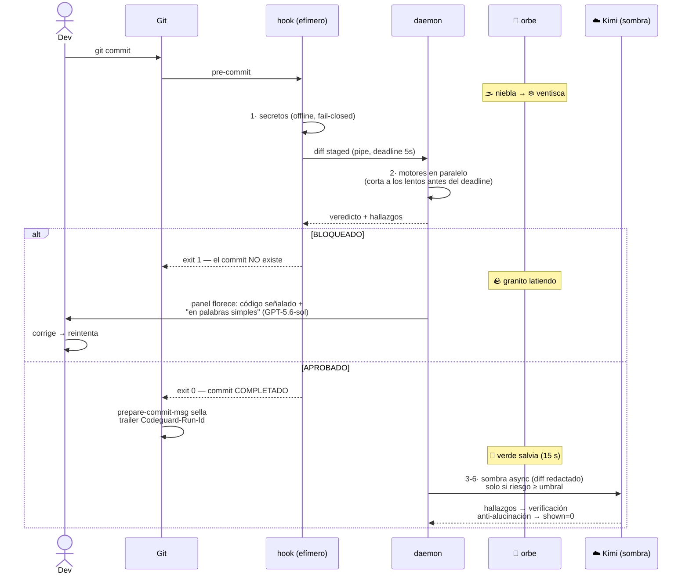

# Flujo del commit

Lo que vive el dev, de `git commit` al verde. El veredicto bloqueante tarda 2-6 s; las sugerencias del modelo llegan después y **jamás retrasan el commit**.

## Reglas del flujo

- **El verde y el commit son el mismo instante** — no hay aprobación posterior.
- `--no-verify` existe: el commit pasa, pero `post-commit` lo registra como bypass (señal de producto, no castigo).
- Todo intento (bloqueado o no) queda en [[Telemetría y calibración|la telemetría]].
- Si CodeGuard truena, el commit pasa ([[00 - CodeGuard|P4]]) — salvo secretos.

Relacionado: [[El orbe]] · [[Pilares y reglas]]
