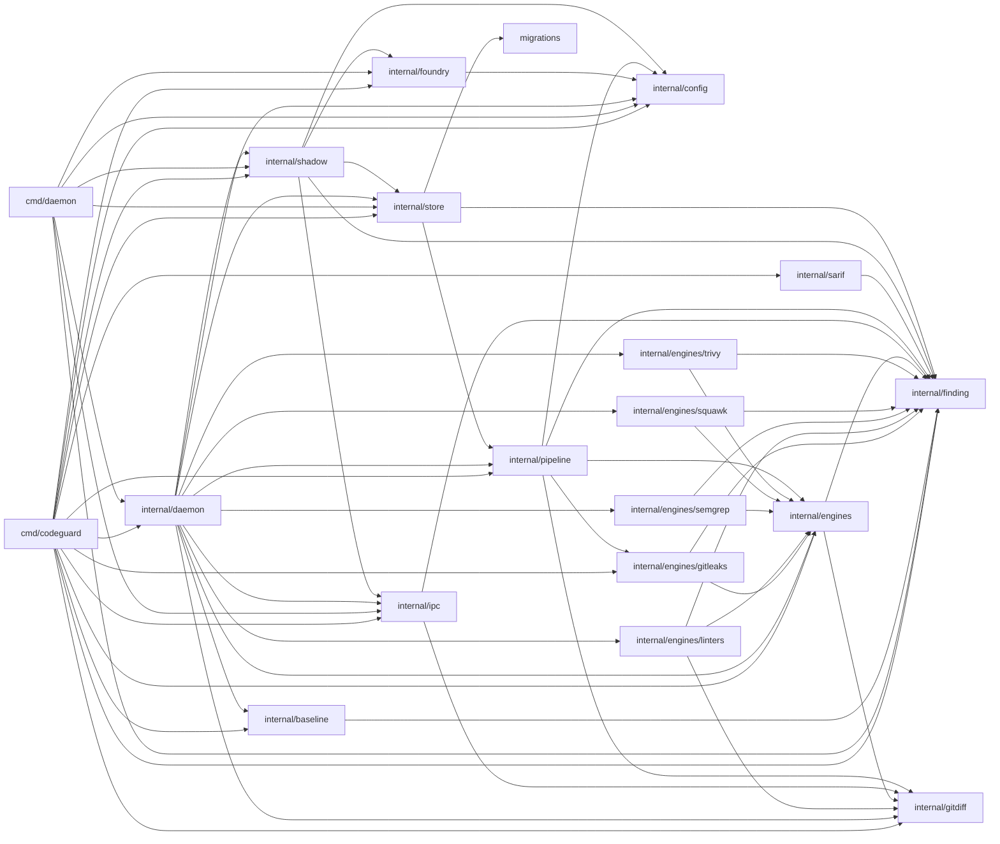

# Grafo de dependencias

Extraído del código real — modo: Go (go list). Regenerar: `codeguard graph  (usa go list bajo el capó)`

```mermaid
flowchart LR
    n_cmd_codeguard["cmd/codeguard"] --> n_internal_baseline["internal/baseline"]
    n_cmd_codeguard["cmd/codeguard"] --> n_internal_config["internal/config"]
    n_cmd_codeguard["cmd/codeguard"] --> n_internal_daemon["internal/daemon"]
    n_cmd_codeguard["cmd/codeguard"] --> n_internal_engines["internal/engines"]
    n_cmd_codeguard["cmd/codeguard"] --> n_internal_engines_gitleaks["internal/engines/gitleaks"]
    n_cmd_codeguard["cmd/codeguard"] --> n_internal_finding["internal/finding"]
    n_cmd_codeguard["cmd/codeguard"] --> n_internal_foundry["internal/foundry"]
    n_cmd_codeguard["cmd/codeguard"] --> n_internal_gitdiff["internal/gitdiff"]
    n_cmd_codeguard["cmd/codeguard"] --> n_internal_ipc["internal/ipc"]
    n_cmd_codeguard["cmd/codeguard"] --> n_internal_pipeline["internal/pipeline"]
    n_cmd_codeguard["cmd/codeguard"] --> n_internal_sarif["internal/sarif"]
    n_cmd_codeguard["cmd/codeguard"] --> n_internal_shadow["internal/shadow"]
    n_cmd_codeguard["cmd/codeguard"] --> n_internal_store["internal/store"]
    n_cmd_daemon["cmd/daemon"] --> n_internal_config["internal/config"]
    n_cmd_daemon["cmd/daemon"] --> n_internal_daemon["internal/daemon"]
    n_cmd_daemon["cmd/daemon"] --> n_internal_finding["internal/finding"]
    n_cmd_daemon["cmd/daemon"] --> n_internal_foundry["internal/foundry"]
    n_cmd_daemon["cmd/daemon"] --> n_internal_ipc["internal/ipc"]
    n_cmd_daemon["cmd/daemon"] --> n_internal_shadow["internal/shadow"]
    n_cmd_daemon["cmd/daemon"] --> n_internal_store["internal/store"]
    n_internal_baseline["internal/baseline"] --> n_internal_finding["internal/finding"]
    n_internal_daemon["internal/daemon"] --> n_internal_baseline["internal/baseline"]
    n_internal_daemon["internal/daemon"] --> n_internal_config["internal/config"]
    n_internal_daemon["internal/daemon"] --> n_internal_engines["internal/engines"]
    n_internal_daemon["internal/daemon"] --> n_internal_engines_linters["internal/engines/linters"]
    n_internal_daemon["internal/daemon"] --> n_internal_engines_semgrep["internal/engines/semgrep"]
    n_internal_daemon["internal/daemon"] --> n_internal_engines_squawk["internal/engines/squawk"]
    n_internal_daemon["internal/daemon"] --> n_internal_engines_trivy["internal/engines/trivy"]
    n_internal_daemon["internal/daemon"] --> n_internal_gitdiff["internal/gitdiff"]
    n_internal_daemon["internal/daemon"] --> n_internal_ipc["internal/ipc"]
    n_internal_daemon["internal/daemon"] --> n_internal_pipeline["internal/pipeline"]
    n_internal_daemon["internal/daemon"] --> n_internal_shadow["internal/shadow"]
    n_internal_daemon["internal/daemon"] --> n_internal_store["internal/store"]
    n_internal_engines_gitleaks["internal/engines/gitleaks"] --> n_internal_engines["internal/engines"]
    n_internal_engines_gitleaks["internal/engines/gitleaks"] --> n_internal_finding["internal/finding"]
    n_internal_engines_linters["internal/engines/linters"] --> n_internal_engines["internal/engines"]
    n_internal_engines_linters["internal/engines/linters"] --> n_internal_finding["internal/finding"]
    n_internal_engines_linters["internal/engines/linters"] --> n_internal_gitdiff["internal/gitdiff"]
    n_internal_engines_semgrep["internal/engines/semgrep"] --> n_internal_engines["internal/engines"]
    n_internal_engines_semgrep["internal/engines/semgrep"] --> n_internal_finding["internal/finding"]
    n_internal_engines_squawk["internal/engines/squawk"] --> n_internal_engines["internal/engines"]
    n_internal_engines_squawk["internal/engines/squawk"] --> n_internal_finding["internal/finding"]
    n_internal_engines_trivy["internal/engines/trivy"] --> n_internal_engines["internal/engines"]
    n_internal_engines_trivy["internal/engines/trivy"] --> n_internal_finding["internal/finding"]
    n_internal_engines["internal/engines"] --> n_internal_finding["internal/finding"]
    n_internal_engines["internal/engines"] --> n_internal_gitdiff["internal/gitdiff"]
    n_internal_foundry["internal/foundry"] --> n_internal_config["internal/config"]
    n_internal_ipc["internal/ipc"] --> n_internal_finding["internal/finding"]
    n_internal_ipc["internal/ipc"] --> n_internal_gitdiff["internal/gitdiff"]
    n_internal_pipeline["internal/pipeline"] --> n_internal_config["internal/config"]
    n_internal_pipeline["internal/pipeline"] --> n_internal_engines["internal/engines"]
    n_internal_pipeline["internal/pipeline"] --> n_internal_engines_gitleaks["internal/engines/gitleaks"]
    n_internal_pipeline["internal/pipeline"] --> n_internal_finding["internal/finding"]
    n_internal_pipeline["internal/pipeline"] --> n_internal_gitdiff["internal/gitdiff"]
    n_internal_sarif["internal/sarif"] --> n_internal_finding["internal/finding"]
    n_internal_shadow["internal/shadow"] --> n_internal_config["internal/config"]
    n_internal_shadow["internal/shadow"] --> n_internal_finding["internal/finding"]
    n_internal_shadow["internal/shadow"] --> n_internal_foundry["internal/foundry"]
    n_internal_shadow["internal/shadow"] --> n_internal_ipc["internal/ipc"]
    n_internal_shadow["internal/shadow"] --> n_internal_store["internal/store"]
    n_internal_store["internal/store"] --> n_internal_finding["internal/finding"]
    n_internal_store["internal/store"] --> n_internal_pipeline["internal/pipeline"]
    n_internal_store["internal/store"] --> n_migrations["migrations"]
```
