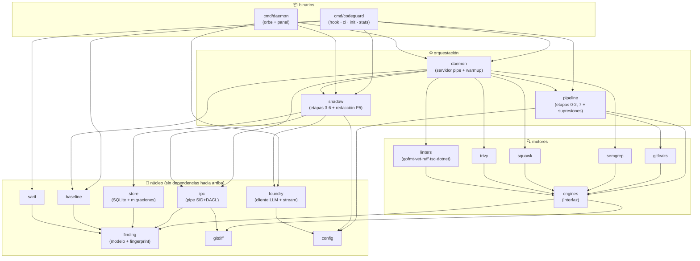

# Grafo de paquetes

El grafo de dependencias **real** del código, extraído del compilador de Go (`go list`). Si este diagrama y el código divergen, el diagrama está mal — regenerarlo, no dibujarlo.

## La lectura arquitectónica

- **El núcleo no depende de nadie de arriba** — `finding`, `gitdiff`, `config` son hojas puras: cambiar la UI o los motores jamás los toca.
- **Todos los motores dependen solo de la interfaz** `engines` — agregar un lenguaje nuevo (Java, Kotlin) es un paquete nuevo que implementa `Engine`, sin tocar nada más.
- **`shadow` no conoce a los motores ni al pipeline** — la capa LLM está aislada: apagarla es no llamarla.
- Los dos binarios comparten todo por debajo — la paridad P3 por construcción.

Cómo regenerarlo: `go list -f '{{.ImportPath}}: {{range .Imports}}{{.}} {{end}}' ./cmd/... ./internal/...`

Relacionado: [[Arquitectura]] · [[00 - CodeGuard]]
