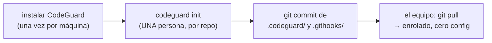

# Onboarding

## El flujo ideal (validado)

`codeguard init` detecta lenguajes, migraciones y exclusiones; genera la config; instala los 3 hooks; crea la baseline (lo preexistente no bloquea — **solo lo nuevo**). Nadie escribe YAML.

## Agentes de IA

Claude Code, Gemini CLI, Codex, Cursor: **funcionan sin integración** — hacen `git commit`, el hook dispara igual. Leen el bloqueo por stderr (`[regla] archivo:línea mensaje`), corrigen, reintentan. CodeGuard además los detecta (env vars) y sube +20 el riesgo de sus diffs.

## Comandos del dev

| Comando | Qué hace |
|---|---|
| `codeguard init` | Enrolar el repo (config + hooks + baseline) |
| `codeguard stats` | Precisión por regla según feedback |
| `codeguard baseline` | Regenerar la supresión de preexistentes |
| `codeguard rules suggest` | Reglas propuestas desde el CLAUDE.md |
| `codeguard repair` | Diagnosticar motores faltantes |
| `codeguard ci --base X` | Lo que corre GitHub Actions |

## Repos ya enrolados

- `knowhub` (TS/Supabase) — baseline 25 · `os-samantha` (Go) — baseline 33

Relacionado: [[Flujo del commit]] · [[00 - CodeGuard]]
