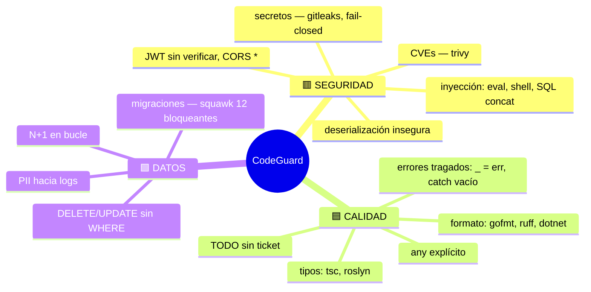

# Pilares y reglas

Tres pilares, ~40 reglas deterministas. El catálogo completo con severidades vive en `rulepacks/2026.08.1/CATALOG.md` (versionado con el rulepack pinneado).

## Gobierno de las reglas

- ⛔ bloquea = exactamente lo mismo que el CI rechazaría
- Los secretos **nunca** entran a baseline ni se degradan
- **Auto-calibración**: ≥5 votos y >20% falsos positivos en un repo → la regla baja a aviso sola
- `codeguard rules suggest` propone reglas nuevas desde el CLAUDE.md del repo (revisión humana obligatoria)
- Falso positivo confirmado en regla determinista → se corrige o se apaga; no se tolera

Relacionado: [[Capa LLM]] · [[Telemetría y calibración]]
