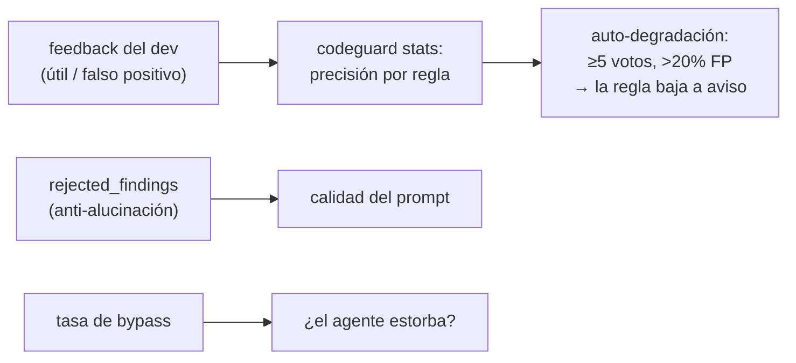

# Telemetría y calibración

**No se puede lanzar y ver qué pasa** — sin calibrar, el análisis estático da 60-90% de falsos positivos y el umbral de abandono está en 20-30%. Todo lo que el sistema hace queda medido en SQLite local (Postgres central en fase 5).

## Qué se registra

| Tabla | Contiene |
|---|---|
| `runs` | Cada análisis: veredicto, riesgo, IA, bypass, paridad, latencia |
| `findings` | Cada hallazgo con fingerprint (clave de supresión/caché) |
| `feedback` | Los clics útil/falso positivo — **la única palanca de calibración** |
| `llm_calls` | Tokens, latencia, hallazgos rechazados por pilar |

## Los lazos que aprenden

## Protocolo de calibración (spec §17) — pendiente de datos

1. Línea base: % pushes que pasan CI al primer intento (30 días atrás)
2. Sombra ≥2 semanas → 500+ hallazgos
3. Etiquetado doble de 200 hallazgos → precisión por regla
4. Poda: regla <80% se corrige o apaga
5. Ensayo aleatorizado (con/sin agente) — el paso que Meta corrió con MetaMateCR
6. Rollout progresivo — no avanzar si bypass >15%

Relacionado: [[Pilares y reglas]] · [[Capa LLM]]
